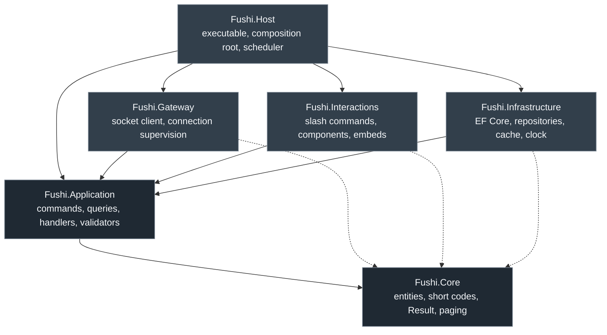
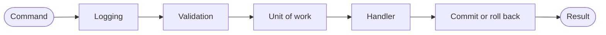

# Architecture

Fushi is a Discord bot that runs community applications through moderated voting
cycles. This document explains how the code is arranged, why the arrangement is
what it is, and where a given piece of behaviour belongs.

If you are looking for what the bot *does* rather than how it is built, read
[domain.md](domain.md) first.

## Layers

Solid arrows are project references. Dotted arrows are the transitive reach into
`Fushi.Core` that comes free with a reference to `Fushi.Application`; they are
drawn because those projects do use core types directly, not because they declare
a second reference.

## The dependency rule

**Every reference points inward.** `Fushi.Core` references nothing.
`Fushi.Application` references only `Fushi.Core`. Everything else references
`Fushi.Application`. No project ever references something further out than
itself, and there is no reference cycle anywhere in the graph.

This is enforced structurally rather than by convention: the reference simply
does not exist, so code in `Fushi.Application` cannot mention `DbContext` or
`SocketGuildUser` because those types are not in scope. A violation is a compile
error, not a review comment.

Three things follow from it, and they are the reason the rule is worth the
occasional inconvenience of defining an interface.

**The rules are testable without infrastructure.** The question "does 2 approvals
out of 3 votes pass at a 60% threshold" is answered by `VotingPolicy.Evaluate`,
a pure function on a struct in `Fushi.Core`. Testing it needs no database, no
Discord connection, and no test host. `Fushi.Core.Tests` runs in milliseconds
because there is nothing there to be slow.

**Infrastructure decisions stay reversible.** PostgreSQL, Redis, EF Core, and
Discord.Net are all named in exactly one project each. Replacing any of them is a
rewrite of that project against interfaces that already exist, not an audit of
the whole repository looking for leaked types.

**`Fushi.Core` has zero package references, deliberately.** It is the one
assembly every other assembly loads, so a dependency added there is a dependency
added everywhere, forever. Keeping it empty means a version conflict in some
logging library cannot become a version conflict in the domain model. The
`Description` in `Fushi.Core.csproj` says so, and the project file has no
`PackageReference` element to accidentally extend.

## What belongs in each project

### `Fushi.Core`

The domain model and the primitives every layer shares.

- **Entities** — `Guild`, `Cycle`, `Submission`, `Vote`, `VotingPermission`,
  `AuditEntry`, with their invariants enforced in their constructors and
  methods. State transitions live on the entity: `Submission.Queue`,
  `Cycle.TransitionTo`.
- **Value objects** — `VotingPolicy`, `CycleSchedule`, `CycleWindow`,
  `GuildChannels`, `VoteTally`. All `readonly record struct`, all validating in
  their constructors.
- **Identifiers** — `ShortCode` and `ShortCodeAlphabet`, the six-character public
  codes described in [domain.md](domain.md#short-codes).
- **Results and errors** — `Result`, `Result<T>`, `Error`, `ErrorType`. Handlers
  return failure as a value, because "this submission does not exist" is a normal
  outcome of a lookup, not an exceptional one.
- **Utilities** — Discord mention and snowflake formatting, timestamp styles,
  paging (`Page<T>`, `PageRequest`, `PageInfo`).

Nothing here knows that Discord, PostgreSQL, or the .NET generic host exist.
`MentionUtility` produces `<@123>`-shaped strings by string manipulation, not by
calling a Discord library.

### `Fushi.Application`

Everything the bot can be asked to do, as CQRS commands and queries.

- **Commands** — a request to change something, and its handler. One class per
  operation, named for the operation: `CastVoteCommand` and its handler, not a
  `VotingService` with eleven methods. A file per feature folder, so the blast
  radius of a change is visible from the file tree.
- **Queries** — a request for information, and its handler. Queries do not
  mutate and do not participate in the unit of work.
- **Validators** — FluentValidation validators, one per command or query,
  discovered by the pipeline rather than called by hand.
- **Abstractions** — the interfaces the outer layers implement: repositories, the
  unit of work, the clock, the cache, whatever the bot needs from Discord. These
  are *declared* here and *implemented* outward, which is what inverts the
  dependency.
- **Logging** — source-generated `LoggerMessage` partial methods in a `Logging/`
  folder, one file per feature. Source generation rather than
  `logger.LogInformation($"...")` because the generated method allocates nothing
  when the level is disabled, which is why `CA1848` can be suppressed repository-
  wide with a clear conscience.

There are no classes named `*Service` here, and that is a deliberate constraint
rather than a stylistic preference. A service class is where unrelated operations
accumulate until nobody can say what depends on what; a command handler has one
public entry point and a constructor listing exactly what that operation needs.

### `Fushi.Infrastructure`

The implementations of the abstractions `Fushi.Application` declares.

- EF Core 11 `DbContext`, entity configurations, and migrations, on PostgreSQL
  through Npgsql.
- Repositories, which are thin: they translate between the domain model and
  queries, and they do not contain rules.
- The unit of work, which the pipeline commits once per command.
- `HybridCache`, giving an in-process L1 tier and an optional Redis L2 tier. With
  `ConnectionStrings__Redis` empty, L1 runs alone and nothing else changes.
- The clock. Time is injected rather than read from `DateTimeOffset.UtcNow`,
  because scheduling behaviour around a daylight saving transition has to be
  testable without waiting for October.

### `Fushi.Interactions`

The Discord.Net interaction surface: slash command modules, button and select
menu handlers, modals, autocomplete providers, and the embed builders that render
domain objects into Discord messages. It translates an interaction into a command
or query, dispatches it, and turns the `Result` back into a reply. It contains no
rules — if a handler here decides something, that decision belongs in
`Fushi.Application` or `Fushi.Core` instead. See
[interactions.md](interactions.md) for the surface itself.

### `Fushi.Gateway`

The Discord gateway connection and nothing else: the socket client, its
lifecycle, reconnection and session-resume supervision, and the dispatch of raw
gateway events into application commands. Separating this from
`Fushi.Interactions` means the code that worries about a dropped WebSocket is not
mixed with the code that formats an embed.

### `Fushi.Host`

The executable. Configuration binding, dependency registration, hosted services,
health reporting, telemetry wiring, and the cycle scheduler that opens and closes
cycles on the configured schedule. This is the only project that knows the full
composition, and it is the only one that may reference every other.

### Tests

| Project | What it covers | Needs |
| --- | --- | --- |
| `Fushi.Core.Tests` | Entity invariants, transitions, voting arithmetic, short-code round-tripping and folding, schedule resolution across DST | Nothing |
| `Fushi.Application.Tests` | Handlers against substituted abstractions, validators, pipeline ordering | NSubstitute |
| `Fushi.Infrastructure.Tests` | Mappings, migrations, queries, cache behaviour against real engines | Testcontainers (PostgreSQL, Redis), Docker |

All three run on xUnit v3 through Microsoft.Testing.Platform, assert with
Shouldly, and are executables rather than libraries because that is what the
platform requires.

## The CQRS pipeline

Every command passes through the same three behaviours, in this order. The order
is not arbitrary and changing it changes what the system guarantees.

**1. Logging.** Records the command being handled, its outcome, and how long it
took, using the source-generated methods in `Fushi.Application/Logging`.
Outermost so that the duration it measures covers everything — validation and the
commit as well as the handler — and so that a request rejected by validation still
appears in the log. That second property matters more than it sounds: a command
users report as "doing nothing" is almost always one being refused early, and a
log that omitted those would hide exactly the cases worth diagnosing.

Volume is not a concern, because a validation rejection is written at debug level
with its reasons, not at information level as a handled command.

**2. Validation.** FluentValidation validators for the command run next. A
failure returns `Result` carrying an `Error` of type `ErrorType.Validation`
without the handler ever being entered. Before the unit of work so that a
malformed request never causes a transaction to be opened, and before the handler
so that everything after it is entitled to assume its input is structurally
sound — a handler should not have to re-check that a short code parses.

**3. Unit of work.** Opens the transaction, runs the handler, and commits once if
the handler returned success. A failed `Result` rolls back, so a handler that
gives up halfway cannot leave a half-applied change behind — and, importantly, a
handler does not have to remember to save. Innermost because it must be the last
thing to open and the first thing to close.

Queries skip the unit of work entirely. They have nothing to commit, and wrapping
a read in a transaction only holds a connection open for no benefit.

## Why PostgreSQL and not MySQL

The original intent was MySQL. It is not available, and the reason is worth
recording so the decision is not revisited from scratch.

There is no official MySQL provider for EF Core 10 or EF Core 11. Oracle's
`MySql.EntityFrameworkCore` has not tracked recent EF majors, and Pomelo — the
provider most MySQL-on-EF-Core projects actually use — tops out at EF Core 9.
Staying on MySQL would have meant one of three things:

1. Depending on an unofficial community fork of a provider for a preview EF
   version, with no support commitment and no guarantee it survives the next
   preview.
2. Freezing EF Core at 9 while the SDK moves to 11 — two majors behind. Central
   package management makes the mismatch visible but not harmless: the
   `Microsoft.Extensions.*` packages EF 9 depends on are a different band from
   the ones the .NET 11 host uses, and preview assemblies across bands do not
   interoperate cleanly.
3. Writing raw SQL and giving up the migration story entirely.

Npgsql ships a provider for every EF Core major in lockstep, including preview
builds — `Npgsql.EntityFrameworkCore.PostgreSQL` 11.0.0-preview.6 exists and
matches the EF Core 11 preview the SDK band pins. The comment in
`Directory.Packages.props` records the same reasoning at the point where the
version is chosen.

PostgreSQL also happens to fit the model better, which made the forced choice an
easy one:

- `timestamptz` maps to `DateTimeOffset` without the precision and time-zone
  ambiguity MySQL's `DATETIME` invites, and this application is unusually
  sensitive to instant handling.
- Partial and expression indexes make the per-guild uniqueness of short codes
  expressible directly, including the soft-delete exclusion.
- `jsonb` gives `AuditEntry.Metadata` a queryable home rather than an opaque text
  column.

## Conventions that hold across projects

- **Failure is a return value.** Handlers return `Result` or `Result<T>`.
  Exceptions are for programmer error and for genuinely unexpected conditions,
  not for "not found" or "you may not vote here".
- **Entities validate themselves.** A `Submission` cannot be constructed in an
  invalid state and cannot be moved to one. Handlers orchestrate; they do not
  re-implement the rule.
- **Public API is documented.** `GenerateDocumentationFile` is on, so a missing
  XML comment on a public member is a warning — advisory locally, fatal in CI.
- **Analyzers run at `AnalysisMode=All`.** The suppression list in
  `Directory.Build.props` is annotated with a justification per rule and is meant
  to shrink over time.
- **Time is injected.** No production code calls `DateTimeOffset.UtcNow`.
- **Codes, not GUIDs, at the boundary.** Anything a user types or reads is a
  six-character short code. GUIDs exist for joins and never appear in a message.
