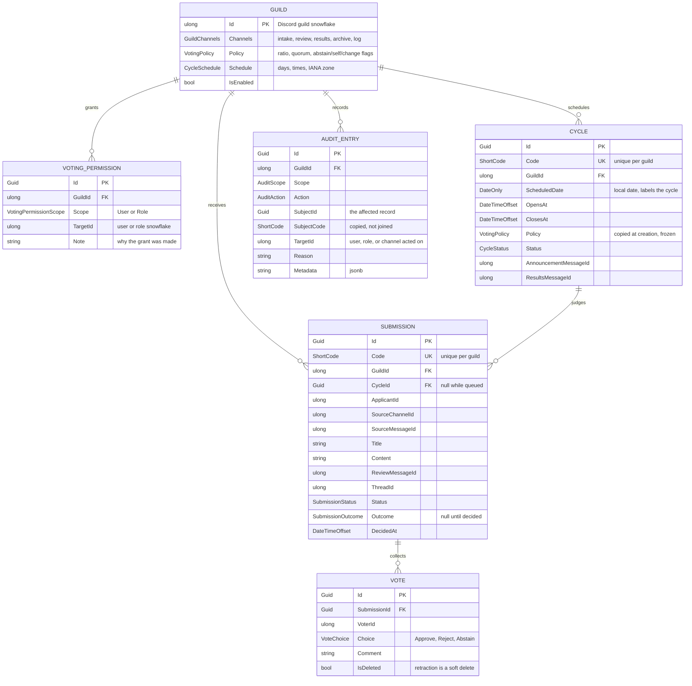
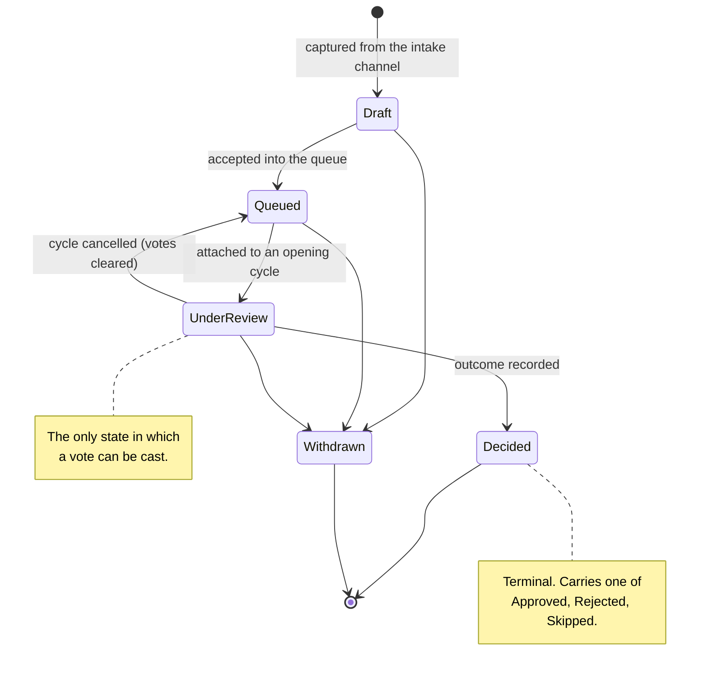
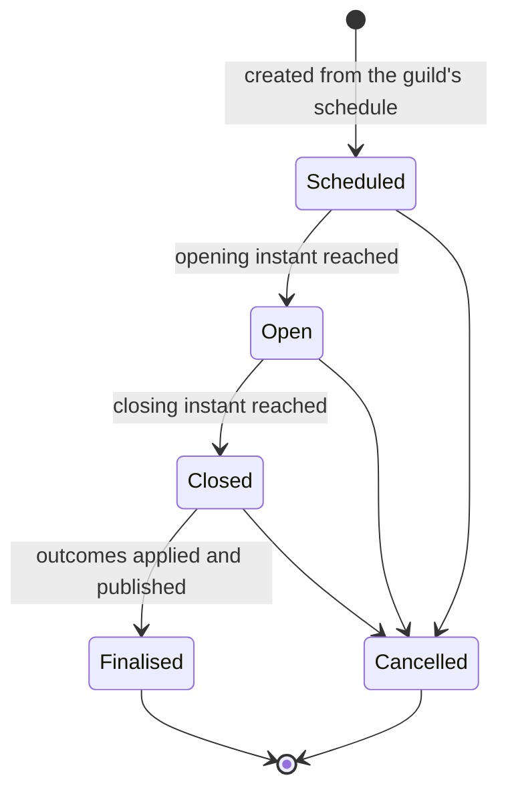

# Domain model

Fushi collects applications from a Discord channel, puts them in front of a group
of people who have been granted the right to vote, and records what they decided.
This document describes the entities, the states they move through, the exact
arithmetic that turns votes into an outcome, and the short-code system that lets
people refer to any of it by typing six characters.

## Entities



A few of these choices are load-bearing.

**`Guild.Id` is the Discord snowflake, not a generated key.** There is exactly one
configuration per server and Discord has already assigned it a permanent unique
number. A second identifier would only create the opportunity for the two to
disagree. A row is created when the bot joins, before anyone has configured
anything, which is why every setting has a default and why `IsOperational`
(enabled, not deleted, intake and review channels both set) is the real test of
whether a guild can run a cycle.

**`Cycle` copies the policy instead of referencing it.** A cycle stores the
`VotingPolicy` that applied when it was created, and the resolved opening and
closing instants rather than the schedule that produced them. Raising the pass
threshold or rescheduling therefore cannot change the terms of a vote already
under way, and a result is still explainable months later from the row alone.

**`Submission.CycleId` is nullable.** A submission outlives the cycle judging it.
It waits in the queue with no cycle, is attached when one opens, and returns to
the queue with its cycle cleared if that cycle is cancelled.

**A retracted vote is soft-deleted, not removed.** `VoteTally.From` skips deleted
votes, so a retraction has no effect on the arithmetic, but the row survives for
the audit trail. Cancelling a cycle soft-deletes every vote cast under it, because
those votes were cast under terms that no longer count and carrying them forward
would let one person's decision apply to two cycles.

**`AuditEntry` copies the subject's short code.** Copied rather than joined, so an
entry still reads sensibly after the record it refers to has been pruned. Audit
entries are written once and never modified — the type derives from `Entity<T>`
rather than `AuditableEntity<T>`, because an audit of the audit would be circular.
`AuditAction` values are explicitly numbered and never reused: renumbering would
silently rewrite history, since existing rows would come back meaning something
else.

## Voting permissions

Voting is **denied by default and opened by grant**. There is no deny rule.

A grant targets either a single user or a role (`VotingPermissionScope`), and
grants are purely additive: holding any live grant that covers you is enough.
Roles are resolved at the moment of the vote rather than stored, so removing
someone's role takes effect immediately.

Two design decisions here are worth stating plainly, because both look
restrictive until you consider the failure mode:

- **Deny-by-default** means a configuration mistake locks people out. Someone
  notices that and reports it. The opposite arrangement — allowed by default,
  closed by exception — fails by quietly letting the wrong people decide
  applications, which nobody notices at all.
- **No deny rule** because a deny rule that loses to an allow rule (or wins over
  one) produces a permission system whose effective answer nobody can predict
  without tracing the whole rule set. Revoking is done by removing the grant.

## The submission lifecycle



`Decided` and `Withdrawn` are terminal. A submission in either state cannot be
edited, requeued, voted on, or withdrawn again.

A submission may be revised (title and body) at any point before it becomes
terminal. Its **code**, however, may only be reassigned before it has been
published to the review channel: once `ReviewMessageId` is set the code is in
circulation, and people have written it down.

## The cycle lifecycle



Any other transition throws. Repeating the state a cycle is already in is a no-op,
which is what makes a retried scheduler pass safe: if the process restarts between
deciding to open a cycle and recording that it opened, the second attempt does not
fail.

`Finalised` and `Cancelled` are terminal. Cancelling returns every attached
submission to the queue and clears its votes.

**Accepting a vote requires both the status and the clock to agree.**
`Cycle.IsAcceptingVotes` is true only when the status is `Open`, the cycle is not
deleted, *and* the instant falls inside the window. The status can lag the clock
by however long the scheduler takes to notice that closing time has passed, and a
vote arriving in that gap is late even though the row still says `Open`.

The window is half-open: the opening instant is inside it, the closing instant is
not. That is the only reading under which two adjacent windows do not both claim
the same instant.

## Scheduling

A guild's `CycleSchedule` is a recurring rule in wall-clock terms, because that is
how the people running the server think about it. The default is **Monday,
Wednesday, and Saturday, 10:00–22:00, `Europe/Berlin`** — three cycles a week, no
two on consecutive days.

| Field | Type | Default |
| --- | --- | --- |
| `Days` | `CycleDays` flags | `Standard` (Monday, Wednesday, Saturday) |
| `OpensAt` | `TimeOnly` | 10:00 |
| `ClosesAt` | `TimeOnly` | 22:00 |
| `TimeZoneId` | IANA identifier | `Europe/Berlin` |

`CycleDays` is a bit field with the named combinations people actually ask for:
`Standard`, `Weekdays`, `Weekend`, `Daily`, and `None`. A schedule of `None` never
opens a cycle, which is how a guild pauses without losing its configuration.

If `ClosesAt` is at or before `OpensAt`, the window is read as closing on the
following day. That is how an overnight window is expressed.

### Why an IANA identifier and not an offset

The zone is stored as `Europe/Berlin`, never as `+01:00` or `+02:00`. An offset
cannot express "the local working day": Berlin is UTC+1 in January and UTC+2 in
July, so a stored offset would silently shift every winter cycle by an hour.
Resolution happens per date, never once and cached.

Resolving a wall-clock time onto a date is not mechanical, and both edge cases are
handled explicitly rather than left to throw:

- **Clocks forward.** The configured local time may not exist at all. Resolution
  steps forward in fifteen-minute increments to the first instant that does,
  rather than throwing at someone who configured a perfectly reasonable 02:30
  start.
- **Clocks back.** The local time exists twice. Opening takes the earlier instant
  and closing takes the later one, so a window is never shortened by a transition.

A consequence: `CycleWindow.Duration` is not always the difference between the
configured times. A window spanning a transition is an hour longer or shorter than
it looks on a clock, and that is correct.

This is also why `InvariantGlobalization` must stay `false`. Under invariant
globalization every `TimeZoneInfo.FindSystemTimeZoneById` call throws
`TimeZoneNotFoundException` — and it throws when the scheduler tries to resolve a
window, not at startup, so the symptom is "the bot stopped running votes" rather
than a crash on boot. See [operations.md](operations.md#troubleshooting).

## Voting arithmetic

Three counts are kept per submission, from its live (non-retracted) votes:

| Term | Definition |
| --- | --- |
| **Approvals** | Votes of `Approve` |
| **Rejections** | Votes of `Reject` |
| **Abstentions** | Votes of `Abstain` |
| **Deciding votes** | Approvals + Rejections |
| **Total votes** | Deciding votes + Abstentions |
| **Approval ratio** | Approvals ÷ Deciding votes, or 0 when there are none |

Two independent gates then apply, in this order:

1. **Quorum** — did enough people express a judgement for the result to mean
   anything? Measured against **deciding votes**, not total votes. Default: 3.
2. **Ratio** — of those who did, did enough approve? Measured as approvals over
   deciding votes, compared **inclusively** (`>=`). Default: 0.60.

```
if decidingVotes < quorum  or  decidingVotes == 0:
    Skipped
else if approvals / decidingVotes >= requiredRatio:
    Approved
else:
    Rejected
```

The `decidingVotes == 0` guard matters when a guild sets quorum to 0 to disable
the gate: zero votes still produces `Skipped` rather than a division by zero or a
vacuous rejection.

The comparison being inclusive means a policy of exactly `0.5` passes a submission
on a tie. That is a choice, not an accident. A guild that wants a strict majority
should configure a ratio above one half.

One caveat in the current implementation: a configured ratio of exactly `0` is
read as "unconfigured" and falls back to the 0.60 default. If you genuinely want
every submission that reaches quorum to pass, set a very small positive ratio
rather than zero.

### Why abstentions count for nothing

An abstention is recorded as participation — it appears in the total and in the
audit trail — but it is excluded from **both** the ratio and the quorum.

An abstention is a deliberate statement that the voter read the submission and
declined to judge it. That is worth recording: it distinguishes a panel member who
engaged from one who never looked. But it must not tip a decision. If abstentions
counted towards the ratio's denominator, abstaining would be equivalent to
rejecting; if they counted towards quorum, a panel could reach quorum without a
single person having formed an opinion.

### Approved, Rejected, and Skipped

| Outcome | Condition | Meaning |
| --- | --- | --- |
| `Approved` | Quorum met, ratio met | The panel said yes |
| `Rejected` | Quorum met, ratio missed | The panel said no |
| `Skipped` | Quorum not met | The panel did not decide |

**`Skipped` is not a rejection, and conflating the two would be a real harm to
applicants.** "Nobody looked at it" and "the people who looked said no" are
different facts about the world. Only one of them is information about the
application; the other is information about the panel's availability that week.

Reporting a quorum failure as a rejection would mean an applicant whose submission
landed on a quiet week carries a rejection they never earned — and, in a system
where past rejections inform future judgements, that error compounds. Reporting it
as `Skipped` keeps the submission eligible to be judged properly later, and makes
the operational problem (too few active voters) visible as itself rather than
disguised as a run of unpopular applications.

### Worked examples

Default policy: quorum 3, ratio 0.60.

| Approvals | Rejections | Abstentions | Deciding | Ratio | Outcome | Why |
| ---: | ---: | ---: | ---: | ---: | --- | --- |
| 3 | 1 | 0 | 4 | 0.75 | Approved | Quorum met, 75% ≥ 60% |
| 2 | 2 | 0 | 4 | 0.50 | Rejected | Quorum met, 50% < 60% |
| 3 | 2 | 0 | 5 | 0.60 | Approved | Exactly 60%, comparison is inclusive |
| 2 | 0 | 0 | 2 | 1.00 | Skipped | Unanimous, but only 2 deciding votes |
| 2 | 0 | 5 | 2 | 1.00 | Skipped | Abstentions do not count towards quorum |
| 0 | 0 | 4 | 0 | 0.00 | Skipped | Four people looked; none judged |
| 0 | 3 | 0 | 3 | 0.00 | Rejected | Quorum met, genuinely rejected |

The last two rows are the pair worth internalising: both have an approval ratio of
zero, and they mean entirely different things.

### Live progress

`VotingPolicy.ApprovalsNeeded` reports how many further approvals would secure a
pass given the votes so far, for rendering progress on a review message. It
assumes no further rejections arrive, so it is a best case rather than a
prediction.

### Policy flags

Beyond the ratio and quorum, `VotingPolicy` carries three switches:

| Flag | Default | Effect |
| --- | --- | --- |
| `AllowAbstain` | `true` | Whether `Abstain` is offered as a choice |
| `AllowSelfVote` | `false` | Whether an applicant may vote on their own submission |
| `AllowVoteChange` | `true` | Whether a voter may revise their vote while the cycle is open |

These are enforced by the command handler, not by the `Submission` entity. Whether
a caller may vote at all depends on the guild's grants and the caller's current
roles, neither of which a submission knows about. What the entity guarantees is
the part it can see: one voter never ends up with two live votes on one
submission.

## Short codes

Every entity a user can address carries a six-character public code alongside its
internal GUID primary key. The GUID is what the database and the code join on and
never appears in the interface. The code is what a person works with:
`/submission view code:7K4M2P` is something a moderator can relay over voice chat,
which `3f2504e0-4f89-11d3-9a0c-0305e82c3301` is not.

### The alphabet

Crockford Base32: the digits `0`–`9` followed by the letters `A`–`Z` with `I`,
`L`, `O`, and `U` removed.

```
0123456789ABCDEFGHJKMNPQRSTVWXYZ
```

`I`, `L`, and `O` are dropped because they are visually confusable with `1` and
`0` in most fonts, and these codes are read off a screen and typed by hand. `U` is
dropped so a randomly generated code is far less likely to spell something
unfortunate in front of a room of moderators.

### Confusable folding on input

Because the confusable letters are excluded from *output* rather than merely
discouraged, they can be reinterpreted unambiguously on *input*. Nothing is lost,
because no valid code ever contained them:

| Typed | Read as |
| --- | --- |
| `I`, `i`, `L`, `l` | `1` |
| `O`, `o` | `0` |
| any lower-case letter | its upper-case form |

Parsing also ignores hyphens, underscores, spaces, and tabs, so `7k4-m2p` and
`7K4M2P` both resolve to the same code. It stays strict about the code itself: a
wrong code is rejected rather than silently coerced into a different one. Input
must contain exactly six alphabet characters after folding, or parsing fails.

### The code space

Six characters over a 32-symbol alphabet is 32⁶ = **2³⁰ = 1,073,741,824** distinct
codes.

Codes are generated from a cryptographically secure random source. The alphabet
size is a power of two, so masking raw random bits down to thirty selects each
code with exactly equal probability — no rejection sampling is needed, and none of
the bias a modulo reduction against a non-power-of-two alphabet would introduce is
present. A cryptographic source rather than `System.Random` because codes address
moderation records, and a predictable sequence would let someone enumerate
submissions that were never shared with them.

The all-zero value is reserved to mean "no code assigned", so `default(ShortCode)`
is recognisably empty rather than a legitimate-looking `000000`. Generation never
produces it.

### Why uniqueness is enforced rather than assumed

A billion codes sounds like more than enough, and for *exhaustion* it is. But
exhaustion is not the relevant risk — **collision** is, and the birthday bound
makes collision arrive far sooner than intuition suggests.

For a pool of `N` equally likely values, the number of draws at which the
probability of at least one repeat reaches 50% is approximately `1.1774 × √N`.
With `N = 2³⁰`:

```
1.1774 × √1,073,741,824  =  1.1774 × 32,768  ≈  38,600
```

So a busy instance has an even chance of generating a duplicate code somewhere
around **38,000 codes** — a number a single active community reaches in a few
years, and a shared instance reaches much sooner. Waiting for the birthday
collision to happen and then finding out about it as a database error at three in
the morning is not an acceptable design.

Three things follow, and all three are needed:

1. **Codes are unique per guild, not globally.** Scoping the constraint to a guild
   is what makes the pool per-community rather than shared, and it is also the
   right semantics: a moderator in one server has no reason to be able to address
   a submission in another.
2. **A unique database index enforces it.** Randomness is not a guarantee, and the
   only place a uniqueness claim can actually be *enforced* is the storage engine.
3. **Generation retries on conflict.** The insert is attempted, and if the index
   rejects it, a fresh code is generated and the insert is retried. At 38,000
   codes in a guild the retry rate is negligible; the point is that the failure
   path exists and is handled rather than surfacing as an error to a user.

`Submission.ReassignCode` is the retry path's entry point, and it refuses to act
once the submission has been published to the review channel — at that point the
code is in circulation and changing it would break a reference someone has already
written down.
