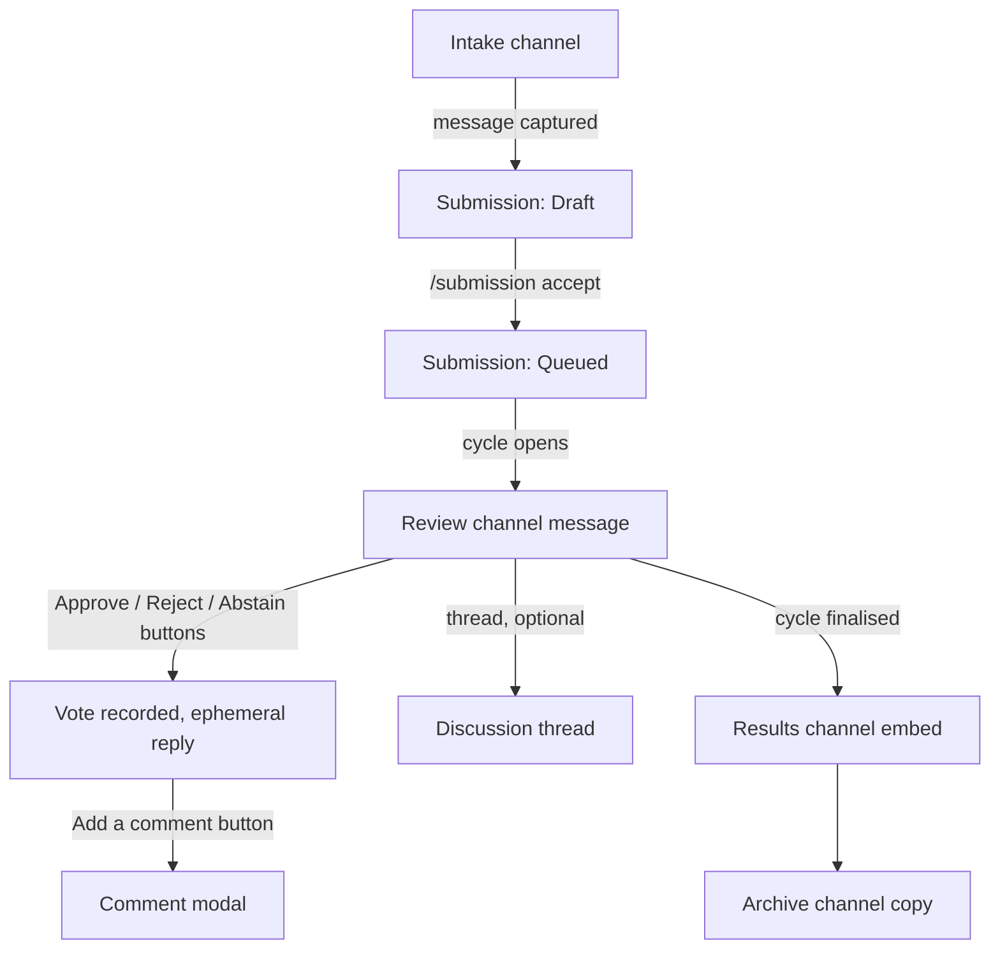

# Interaction reference

Every command, option, and component Fushi exposes, and who is allowed to use it.

Two conventions run through all of it:

- **Submissions and cycles are addressed by six-character short code**, never by
  an internal identifier. Codes are case-insensitive, tolerate hyphens,
  underscores and spaces, and fold the confusable letters `I`/`L` to `1` and `O`
  to `0`. Details in [domain.md](domain.md#short-codes).
- **Every `code` option is backed by an autocomplete handler**, so in practice
  nobody types a code from memory — they type two characters and pick from the
  list. Typing the whole thing still works, which matters when a code arrives over
  voice chat or in a screenshot.

## Permission model

Three separate things gate a command, and it is worth keeping them apart:

| Gate | Enforced by | Applies to |
| --- | --- | --- |
| Discord permission | Command's default member permissions | `/config`, `/voter`, `/cycle` |
| Voting grant | Fushi's own `VotingPermission` records | `/vote` |
| Ownership | The handler, comparing the caller to the applicant | `/submission withdraw` |

A Discord permission is a coarse "is this person staff" check that Discord itself
enforces, so the command does not appear for people who lack it. A voting grant is
Fushi's own deny-by-default permission, entirely independent of Discord roles and
of Discord's permission system — someone with Administrator cannot vote unless
they have been granted the right explicitly. That is intentional: administering a
server and sitting on the review panel are different jobs.

## `/config` — guild configuration

Requires **Manage Server**.

**No command in this group takes an option.** Each is an entry point to a panel,
and every setting is written by a component on that panel. A slash command option
is filled in blind — Discord shows its name and nothing else, not the current
value, not the legal range, not what it interacts with — so the failure mode was
guessing and being refused. A menu cannot express an illegal value and opens
showing the current one.

| Command | Options | Opens |
| --- | --- | --- |
| `/config show` | — | Current channels, policy, schedule, and enabled state, with a button into each. Ephemeral. |
| `/config channels` | — | The five roles, each with a **Set** / **Change** button leading to its own picker. |
| `/config policy` | — | Threshold and quorum selects, and three toggle buttons. |
| `/config schedule` | — | Day multi-select and presets, plus buttons for each end of the window and the time zone. |
| `/config enable` | — | Nothing. Allows cycles to open. |
| `/config disable` | — | A confirmation. Stops new cycles opening, keeping all configuration and history. |

Behind `SetChannel`, one role per command. The older `ConfigureChannels`, which
carried all five channels with `null` meaning "leave alone", could not express
clearing one: absence already meant no change, so no value was left over to mean
removal. Naming the role separates the two, and a `null` channel now unambiguously
clears.

The threshold is chosen as a whole percentage and divided at the interaction
boundary, because the bar is discussed as "sixty percent" and the domain stores a
ratio.

Time zones are chosen region-first and paged, since a select menu holds
twenty-five options and there are several hundred zones. The list is read from the
host, so anything offered is by construction something the host can resolve —
which is what removes the old class of failure where a valid-looking identifier
was accepted and then fell back to UTC inside the scheduler.

**Components**

| Component | Custom ID | Purpose |
| --- | --- | --- |
| Buttons | `cfg:home`, `cfg:chan`, `cfg:pol`, `cfg:sch` | Move between panels. Every panel carries a **Back** |
| Buttons | `cfg:chan:open:*` | Open one role's picker |
| Channel select | `cfg:chan:set:*` | Text, announcement, and thread types everywhere; **forum** additionally for intake |
| Button | `cfg:chan:clr:*` | Clear an optional role. Not rendered for intake or review, which the command refuses to clear |
| String selects | `cfg:pol:ratio`, `cfg:pol:quorum` | Approval threshold and quorum |
| Buttons | `cfg:pol:tog:*:*` | Flip a voting switch. The target value is encoded, not inferred, so the label and the effect cannot disagree |
| String select (multi) | `cfg:days` | Day-of-week picker |
| Buttons | `cfg:preset:*` | `standard`, `weekdays`, `weekend`, `daily`, `none` |
| Buttons | `cfg:time:*` | Open the picker for one end of the window |
| String selects | `cfg:hour:*`, `cfg:min:*` | Hour and minute. Each moves only the half it names |
| String selects | `cfg:tzr`, `cfg:tzz:*:*` | Region, then zone within it |
| Buttons | `cfg:tzp:*:*` | Page a region's zones |
| Confirmation buttons | `ok:disable` | Disabling stops every cycle opening, which is worth one extra click |

## `/voter` — voting rights

Requires **Manage Roles**.

| Command | Options | Notes |
| --- | --- | --- |
| `/voter grant` | — | Opens a mentionable select taking up to ten users and roles at once. Re-granting an existing grant is a no-op, not an error. |
| `/voter revoke` | — | Opens a mentionable select taking one. Removes the grant; there is no deny rule, so revoking *is* removal. |
| `/voter list` | `page?` (integer) | Paginated. Shows scope, mention, who granted it, when, and the note. Every row carries a **Revoke**. |

Granting and revoking use a mentionable select rather than a `user?` / `role?`
pair. The pair had to be validated — exactly one, never both, never neither — and
the mentionable select makes that failure unrepresentable, since one control
returns one thing and its type says which kind it is. It also grants several at
once, which two scalar options could not do at all.

The note is a modal offered after a single grant rather than an option on it. It
is prose, so no menu could offer it; and asking for a justification before the
grant takes effect would slow the common case for the sake of the rare one. A
modal spanning several grants would have to guess which of them one note
described, so it is offered only when exactly one was made.

**Components**

| Component | Custom ID | Purpose |
| --- | --- | --- |
| Mentionable select | `vtr:grant:pick` | Users and roles together, up to ten |
| Mentionable select | `vtr:revoke:pick` | One at a time, so a role's confirmation can state its blast radius |
| Button | `vtr:note:*:*` | Opens the note modal for a single grant |
| Modal | `m:vtrnote:*:*` | Re-grants with the note attached, which updates the existing row |
| Buttons | `vtr:grant`, `vtr:list` | Move between granting and the list |
| Button per row | `rev:*:*` | Revoke that row |
| Confirmation buttons | `ok:revoke:*:*` | Revoking a role grant can remove voting rights from many people at once |

## `/cycle` — voting cycles

Requires **Manage Messages**. Every one of these is also something the scheduler
does on its own; the commands exist for the cases the schedule does not cover.

| Command | Options | Notes |
| --- | --- | --- |
| `/cycle status` | `code?` (string, autocomplete) | The current cycle by default. Shows the window, time remaining, submission count, and per-submission tallies. |
| `/cycle open` | `date?` (`YYYY-MM-DD`) | Opens a cycle ahead of schedule. Fails if one is already open, or if the guild is not operational. |
| `/cycle close` | `code?` (string, autocomplete) | Stops accepting votes without deciding anything. Reversible only by cancelling. |
| `/cycle finalise` | `code?` (string, autocomplete) | Applies the policy to every attached submission, records outcomes, publishes results. Requires the cycle to be closed. |
| `/cycle cancel` | `code?` (string, autocomplete), `reason?` (string) | Abandons the cycle. Returns every submission to the queue and **clears the votes cast under it**. |
| `/cycle list` | `status?` (choice), `page?` (integer) | Recent cycles, newest first. |

`/cycle finalise` requires a **closed** cycle rather than working on an open one,
because finalising while votes are still arriving would decide submissions on an
incomplete tally. Close first, then finalise; the scheduler does both in sequence
on its own.

Cancelling clears votes because they were cast under a cycle that no longer counts,
and carrying them into the next one would let one person's decision apply twice.
This is destructive and the confirmation says so.

**Components**

| Component | Where | Purpose |
| --- | --- | --- |
| Autocomplete | every `code` option | Recent cycles, shown as code plus date plus status |
| Button per row | `cyc:close`, `cyc:final:*`, `cyc:cancel:*` on `/cycle list` | The one action the cycle in that row still needs, chosen from its status. A decided cycle gets none |
| Confirmation buttons | `open`, `close`, `finalise`, `cancel` | All four change state visible to everyone in the guild |
| Modal | `cancel` | Collects the reason, recorded on the audit entry |
| Results panel | after `finalise` | Posted to the results channel, or the review channel if none is set |

A row button opens the same confirmation the matching command does rather than
carrying the action out. It is a shortcut past looking a code up, not past being
told what is about to be discarded — and one button per row, because a section
carries a single accessory, so the ordinary path through a cycle is the one that
is one press away and the destructive path is not.

## `/submission` — applications

Mixed permissions: reads are open to anyone who can see the channel, writes are
restricted.

| Command | Options | Permission | Notes |
| --- | --- | --- | --- |
| `/submission view` | `code` (string, **autocomplete**) | Anyone | Title, applicant, status, outcome, live tally. Ephemeral unless `public:true`. |
| `/submission list` | `status?` (choice), `applicant?` (user), `page?` (integer) | Anyone | Paginated. Defaults to the current cycle. |
| `/submission queue` | `page?` (integer) | Anyone | Submissions waiting for the next cycle, in the order they will be taken. |
| `/submission withdraw` | `code` (string, autocomplete), `reason?` (string) | Applicant, or **Manage Messages** | Only before a decision. Terminal. |
| `/submission accept` | `code` (string, autocomplete) | **Manage Messages** | Moves a draft into the queue. |

`/submission view` is the command the short-code system exists for. Its `code`
option is the canonical autocomplete case: it searches by code *and* by title
prefix, filtered to the caller's guild, so someone who remembers "the one about the
railway" finds it without a code at all.

`/submission withdraw` is the one command whose permission depends on the caller's
relationship to the record rather than on a Discord permission. The applicant may
withdraw their own submission; a moderator with Manage Messages may withdraw
anyone's, and the audit entry records which of the two happened.

**Components**

| Component | Where | Purpose |
| --- | --- | --- |
| Autocomplete | every `code` option | Matches on code prefix or title substring, current guild only |
| Previous / Next buttons | `list`, `queue` | Page navigation |
| "Make public" button | `view` (ephemeral) | Reposts the embed visibly, so a moderator can share what they are looking at |
| Confirmation buttons | `withdraw` | Terminal and irreversible |
| Modal | `withdraw` | Collects the reason |
| Vote buttons | review channel message | Approve / Reject / Abstain, on the submission's own review message |

## `/vote` — casting votes

Requires a **voting grant** in this guild. No Discord permission grants it; no
Discord permission is required beyond being able to use the channel.

| Command | Options | Notes |
| --- | --- | --- |
| `/vote cast` | `code` (string, autocomplete), `choice` (choice: Approve / Reject / Abstain), `comment?` (string) | Replaces the caller's existing vote if the policy allows changes. Always ephemeral. |
| `/vote retract` | `code` (string, autocomplete) | Removes the caller's vote. |
| `/vote mine` | `code?` (string, autocomplete) | How the caller voted, on one submission or across the open cycle. |

Every `/vote` reply is ephemeral without exception. A visible confirmation would
disclose how someone voted to everyone in the channel, and a panel that can see
each other's votes in real time is a panel that anchors on the first vote cast.
The aggregate tally is public; individual votes are not.

Votes are rejected, with the reason stated, when:

| Condition | Message |
| --- | --- |
| No voting grant covers the caller | Not permitted to vote in this guild |
| The submission is not under review | Votes cannot be cast on a *state* submission |
| The cycle has closed, or the clock is past the closing instant | Voting has closed for this cycle |
| `choice` is `Abstain` and the policy forbids it | Abstaining is disabled in this guild |
| The caller is the applicant and the policy forbids self-voting | You cannot vote on your own submission |
| The caller has already voted and the policy forbids changes | Your vote has already been recorded and cannot be changed |

The clock is checked as well as the cycle's recorded status, so a vote arriving
between the closing instant and the scheduler noticing is late and is refused.

**Components**

| Component | Where | Purpose |
| --- | --- | --- |
| Approve / Reject / Abstain buttons | review channel message | The primary path. `/vote cast` exists for when the message has scrolled away |
| "Add a comment" button | after voting | Opens a modal; the comment attaches to the vote already recorded |
| Modal | comment entry | Optional justification, stored on the vote |
| Autocomplete | every `code` option | Restricted to submissions currently under review, so the list is only ever what can actually be voted on |

The Abstain button is hidden when the guild's policy sets `AllowAbstain` to false,
rather than shown and then refused. A control that exists but always fails is worse
than no control.

## Where components appear

The review message is where nearly all voting actually happens. The slash commands
are the fallback for when it has scrolled out of reach, and the path that works
from a phone.

## Autocomplete behaviour

Discord gives an autocomplete handler a short deadline and sends a request on
roughly every keystroke, which constrains the design:

- Results are capped at Discord's limit of 25 choices.
- Every query is scoped to the invoking guild. A code from another server never
  appears, which matches the per-guild uniqueness of codes.
- Each handler filters to states where the command can actually succeed:
  `/vote cast` offers only submissions under review, `/cycle finalise` only closed
  cycles.
- Choices are rendered `CODE — Title` so the list is readable without the code
  meaning anything to the reader.
- Results are cached briefly, because the same prefix arrives repeatedly as
  someone types and the underlying set does not change between keystrokes.
- An empty input returns the most relevant recent entries rather than nothing, so
  opening the option is itself useful.

## Ephemeral or public

| Response | Visibility | Why |
| --- | --- | --- |
| All `/vote` replies | Ephemeral, always | Individual votes must not be disclosed |
| All `/config` replies | Ephemeral | Channel identifiers and policy are staff business |
| `/voter list`, `/voter check` | Ephemeral | Who may vote is not public information |
| `/submission view` | Ephemeral, with a button to repost publicly | Usually a private lookup; occasionally something to share |
| `/submission list`, `/submission queue` | Ephemeral | Paginated, and pagination in a shared channel is noise |
| `/cycle status` | Public | The aggregate state is meant to be visible |
| Cycle opened / results announcements | Public | The point of them |
